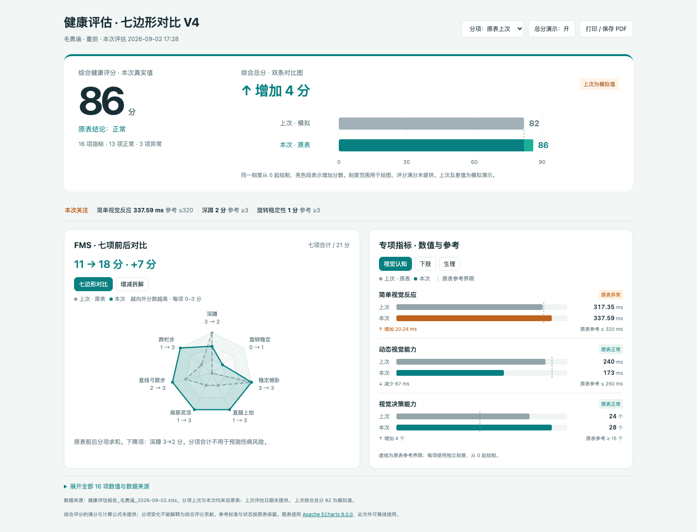

# 健康评估前后对比

一份可离线打开的中文 HTML 健康评估报告。下载 `index.html` 后用浏览器打开；GitHub 文件页面展示的是 HTML 源代码。

## 展示内容

- 综合健康评分：本次 86 分来自原表；上次综合总分缺失，默认 82 分与 +4 分为模拟演示，可关闭。
- FMS：七边形叠加前后分数，每项 0–3 分，越向外分数越高；可切换增减拆解图。原表七项合计 11→18 分。
- 专项指标：上次、本次双条对比，显示变化量、单位和原表参考标准。
- 原表上次 / 模拟上次可切换，模拟不改动本次数据。
- 手机布局与横向 A4 打印。打印当前选中的指标组。

## 数据与解释

原始文件：健康评估报告_毛勇涵_2026-09-02.xlsx，工作表“评估报告”。本次日期 2026-09-02，上次日期未提供。16 项本次数值与原表一致。`data/assessment.json` 提供字段、来源行及核验记录。原始 XLSX 未随上传包发布。

综合评分满分与公式未提供，分项变化不用于解释综合评分贡献。FMS 总分为七项原始分数求和，不用于预测伤病风险。

视觉指标保留原始单位与原表参考标准。动态视觉耗时减少、视觉决策数量增加可直接查看；简单视觉反应原表参考为 ≤320 ms，与此前提出的“越慢越好”有冲突，目前保留原表状态，不转换成表现评分。

YBT 对称性原表单位为“cm 或 %”，仅显示前后数值；YBT 右侧 128.79% 保留原值。

## 技术与验证

FMS 交互图使用 Apache ECharts 6.0.0（Apache-2.0），脚本嵌入 HTML；许可证和 NOTICE 保存在 `licenses/`。界面离线打开时无外部网络请求。

已核验七个轴及原表前后分数、图形切换、模拟切换、320 / 390 / 768 / 1440 像素宽度布局，以及三组各一页横向 A4 打印。

